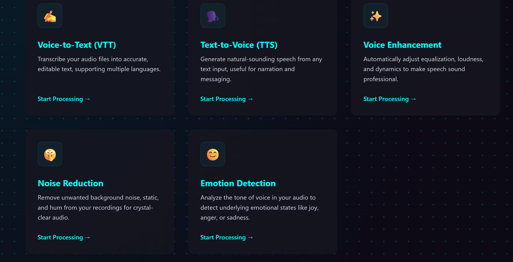
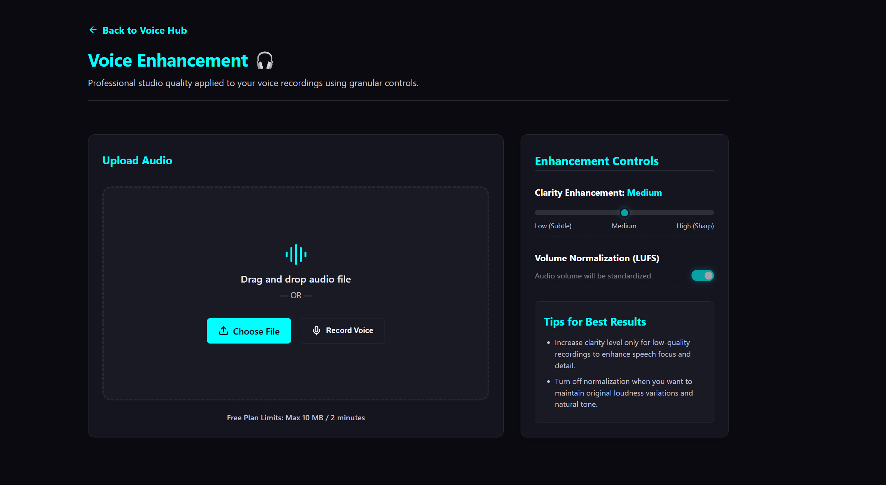
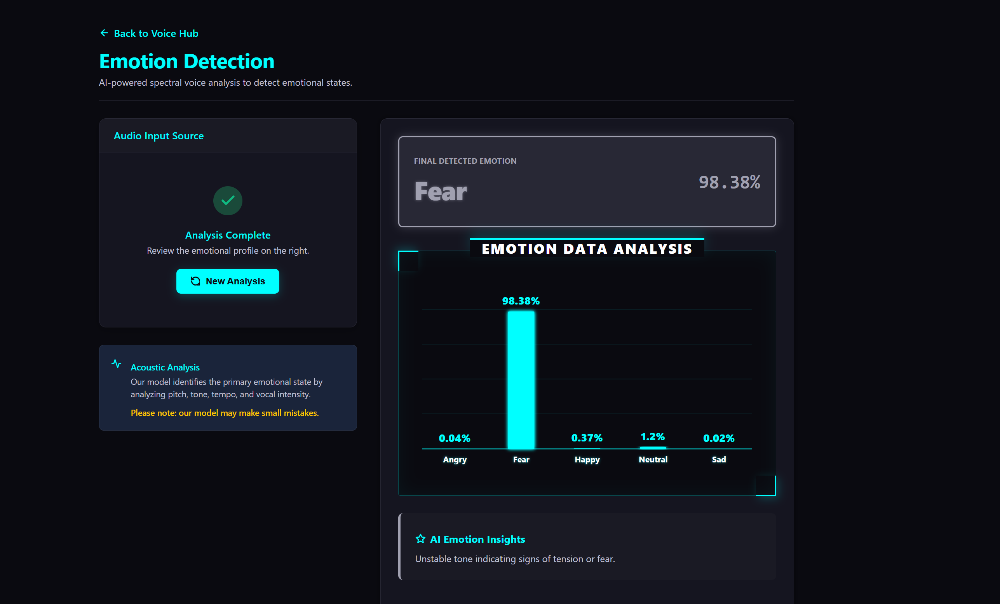
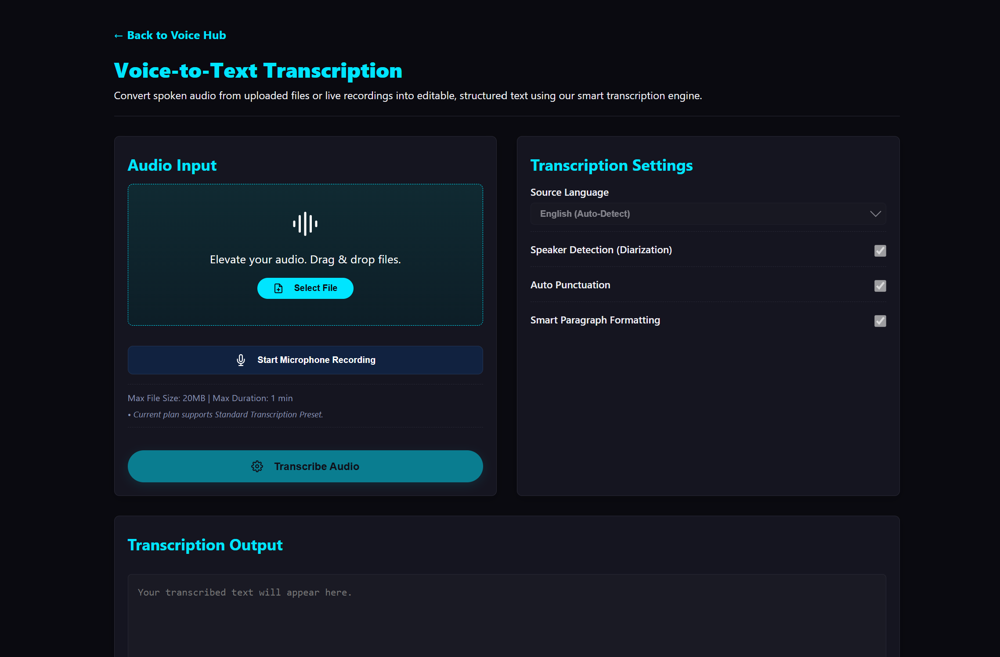
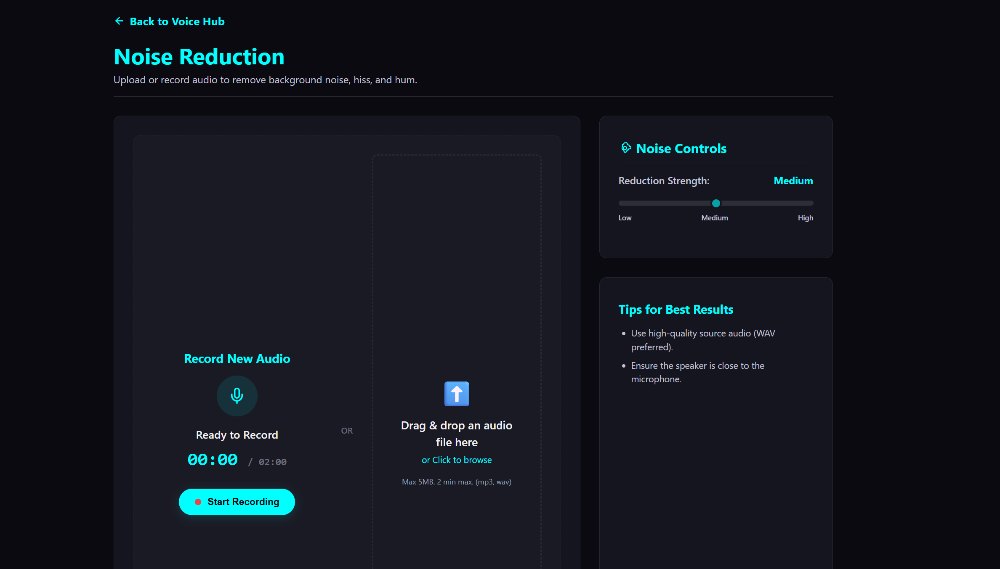
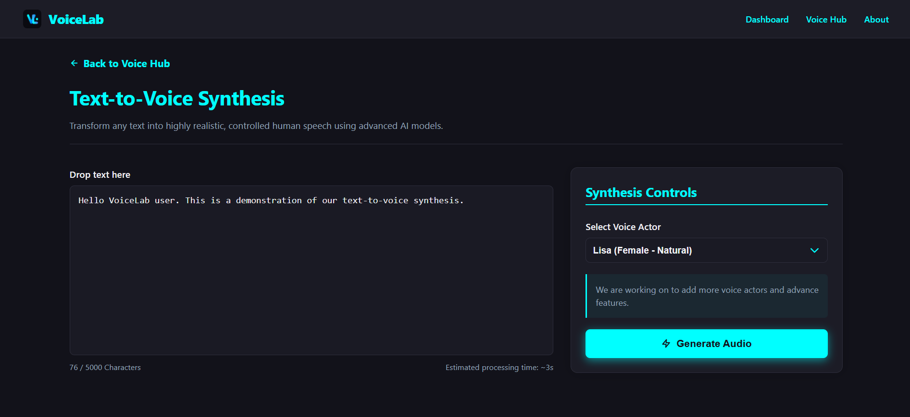

<div align="center">


# 🎙️ VoiceLab — AI-Powered Voice Processing Platform

**An end-to-end intelligent audio processing system combining Deep Learning, ASR, and TTS into a single web platform.**

[](https://www.python.org/)
[](https://fastapi.tiangolo.com/)
[](https://reactjs.org/)
[](https://www.tensorflow.org/)
[](https://vitejs.dev/)
[](LICENSE)

[](https://github.com/openai/whisper)
[](https://github.com/rany2/edge-tts)
[](https://mui.com/)
[](https://recharts.org/)
[](CONTRIBUTING.md)

</div>

---

## 📖 Table of Contents

- [Project Overview](#-project-overview)
- [Key Features](#-key-features)
- [System Architecture](#️-system-architecture)
- [Tech Stack](#-tech-stack)
- [AI / ML Models](#-ai--ml-models)
- [Datasets Used](#-datasets-used)
- [Project Structure](#-project-structure)
- [Installation Guide](#️-installation-guide)
  - [Backend Setup](#backend-setup)
  - [Frontend Setup](#frontend-setup)
- [API Endpoints](#-api-endpoints)
- [Usage Guide](#-usage-guide)
- [Screenshots](#-screenshots)
- [Future Enhancements](#-future-enhancements)
- [Authors](#-authors)

---

## 🧠 Project Overview

**VoiceLab** is an AI-powered, full-stack audio intelligence platform built as a Final Year Project. It provides a unified, browser-accessible workspace where users can:

- Detect emotions from spoken audio using a **custom-trained CNN-BiLSTM deep learning model**
- Transcribe speech to text using **OpenAI Whisper**
- Convert any text into natural-sounding speech via **Microsoft Edge TTS**
- Remove background noise from audio recordings using **spectral gating and adaptive noise estimation**
- Enhance voice quality with **EQ, LUFS normalization, and dynamic compression**

The platform targets a wide audience — from students and content creators to businesses looking to automate and analyze audio workflows. It is architected as a decoupled system: a **Python/FastAPI** backend handling all heavy AI computation, and a **React/Vite** frontend delivering a modern, responsive, cyberpunk-themed UI.

---

## ✨ Key Features

| Feature | Description |
|---|---|
| 🎭 **Emotion Detection** | Classifies spoken audio into 5 emotions (Angry, Fear, Happy, Neutral, Sad) using a CNN-BiLSTM model trained on RAVDESS |
| ✍️ **Voice-to-Text (ASR)** | Transcribes MP3, WAV, M4A, FLAC, and WebM files using OpenAI Whisper with pre-processing noise reduction |
| 🗣️ **Text-to-Voice (TTS)** | Generates natural speech from text using 4 Microsoft Azure Neural Voices (Lisa, Aria, Mike, David) |
| 🔇 **Noise Reduction** | Removes background hiss, hum, and static with adjustable Low / Medium / High strength spectral filtering |
| ✨ **Voice Enhancement** | Applies EQ clarity boosting, soft compression, and LUFS normalization for professional audio output |
| 🎙️ **Live Recording** | Record audio directly in the browser via the Web MediaRecorder API across all feature pages |
| 📊 **Emotion Chart (HUD)** | Cyberpunk-styled bar chart (Recharts) displays per-emotion confidence percentages in real time |
| 🎧 **Audio Comparison** | Side-by-side original vs. processed audio playback for Noise Reduction and Voice Enhancement |
| ⬇️ **Download Results** | Download processed audio as MP3 or transcripts as TXT / DOCX |

---

## 🏗️ System Architecture

```
┌─────────────────────────────────────────────────────────┐
│                    CLIENT (Browser)                      │
│   React 18 + Vite  ──  React Router v6  ──  Axios       │
│   MUI v5  ──  Recharts  ──  WaveSurfer.js  ──  Vanta    │
└────────────────────────┬────────────────────────────────┘
                         │ HTTP (REST)
                         ▼
┌─────────────────────────────────────────────────────────┐
│              BACKEND (FastAPI / Python)                  │
│                                                          │
│  ┌──────────────┐  ┌───────────────┐  ┌──────────────┐  │
│  │  /transcribe │  │/emotion-detect│  │/text-to-voice│  │
│  │  (Whisper)   │  │ (CNN-BiLSTM)  │  │ (Edge TTS)   │  │
│  └──────────────┘  └───────────────┘  └──────────────┘  │
│                                                          │
│  ┌──────────────┐  ┌───────────────────────────────────┐ │
│  │/noise-reduct │  │       /enhance-audio               │ │
│  │ (noisereduce)│  │ (EQ + Compression + pyloudnorm)    │ │
│  └──────────────┘  └───────────────────────────────────┘ │
│                                                          │
│  Audio Pre-processing Pipeline:                          │
│   librosa  ──  soundfile  ──  noisereduce  ──  scipy    │
│   pydub  ──  pyloudnorm                                  │
│                                                          │
│  AI Models:                                              │
│   TensorFlow/Keras  ──  CNN-BiLSTM (.keras)              │
│   OpenAI Whisper (base)                                  │
└─────────────────────────────────────────────────────────┘
```

**Data flow for a typical request:**

1. User uploads or records audio in the browser
2. The frontend sends a `multipart/form-data` POST request to FastAPI
3. The backend saves the file, runs the appropriate AI pipeline
4. Results (JSON, audio URL) are returned to the frontend
5. Temporary files are cleaned up after processing

---

## 🛠️ Tech Stack

### Backend

| Technology | Purpose |
|---|---|
| **Python 3.10+** | Core language |
| **FastAPI** | REST API framework |
| **TensorFlow / Keras** | CNN-BiLSTM emotion model inference |
| **OpenAI Whisper (base)** | Automatic speech recognition |
| **edge-tts** | Microsoft Azure neural text-to-speech |
| **librosa** | Audio loading, MFCC, Mel spectrogram extraction |
| **noisereduce** | Spectral gating noise reduction |
| **soundfile** | Audio I/O (WAV read/write) |
| **pydub** | WAV → MP3 conversion |
| **pyloudnorm** | LUFS loudness normalization |
| **scipy** | Butterworth filters, Savitzky-Golay smoothing |
| **NumPy** | Numerical computation |
| **Uvicorn** | ASGI server |

### Frontend

| Technology | Purpose |
|---|---|
| **React 18** | UI framework |
| **Vite 5** | Build tool & dev server |
| **React Router v6** | Client-side routing |
| **Axios** | HTTP client |
| **MUI (Material UI v5)** | Component library |
| **Recharts** | Emotion data visualization charts |
| **WaveSurfer.js** | Waveform visualization |
| **Vanta.js + Three.js** | Animated 3D hero background |
| **react-toastify** | Notifications |
| **react-hook-form + yup** | Form validation |
| **TanStack Query** | Server state management |

---

## 🤖 AI / ML Models

### 1. Speech Emotion Recognition — CNN-BiLSTM

The core model is a custom-trained **Convolutional Neural Network + Bidirectional LSTM** architecture.

**Input features:**
- **Mel Spectrogram** — 128 mel bands, converted to dB scale
- **MFCC (Mel-Frequency Cepstral Coefficients)** — 13 coefficients
- Combined feature matrix: **141 × 200 × 1** (padded/truncated to 200 frames)
- Z-score normalized before inference

**Output:** Softmax over 5 emotion classes — `['Angry', 'Fear', 'Happy', 'Neutral', 'Sad']`

**Model file:** `app/model/cnn_bilstm_improved.keras`

```
Input (141, 200, 1)
  → Conv2D + BatchNorm + MaxPool
  → Conv2D + BatchNorm + MaxPool
  → Reshape for sequence
  → Bidirectional LSTM
  → Dense + Dropout
  → Softmax (5 classes)
```

### 2. Automatic Speech Recognition — OpenAI Whisper

- Model: **`whisper-base`** (loaded once at startup)
- Language: English, `beam_size=5`, `best_of=5`
- Pre-processing: silence trimming + spectral noise reduction before transcription
- Returns: full transcript text + segmented timestamps

### 3. Neural Text-to-Speech — Microsoft Edge TTS

Powered by `edge-tts` which wraps the Microsoft Azure Cognitive Speech Service:

| Voice ID | Neural Voice | Style |
|---|---|---|
| `lisa` | `en-US-JennyNeural` | Female, Natural |
| `aria` | `en-US-AriaNeural` | Female, Soft |
| `mike` | `en-US-GuyNeural` | Male, Strong |
| `david` | `en-GB-RyanNeural` | Male, Calm |

---

## 📊 Datasets Used

| Dataset | Description | Used For |
|---|---|---|
| **RAVDESS** (Ryerson Audio-Visual Database of Emotional Speech and Song) | 24 professional actors, 8 emotions, ~1500 audio files | Primary training data for CNN-BiLSTM emotion model |
| **TESS** (Toronto Emotional Speech Set) | 200 target words spoken in 7 emotional contexts by 2 female actors | Supplementary training data |
| **CREMA-D** | 7,442 clips from 91 actors with 6 emotion categories | Model robustness and augmentation |

> The final model was trained on a combined, balanced subset of RAVDESS + TESS mapped to 5 unified emotion labels.

---

## 📁 Project Structure

```
Development/
├── Backend/
│   ├── app/
│   │   ├── main.py                  # FastAPI app — all routes & pipelines
│   │   └── model/
│   │       ├── cnn_bilstm_improved.keras     # Production emotion model
│   │       └── cnn_bilstm_2.keras            # Experimental model
│   ├── uploads/                     # Temp storage for incoming audio files
│   ├── outputs/                     # Processed/generated audio output files
│   ├── requirements.txt             # Python dependencies
│   └── README.md
│
└── Frontend/
    └── FYP-project/
        ├── public/
        │   └── logo.svg
        ├── src/
        │   ├── App.jsx              # Root router configuration
        │   ├── assets/              # Developer profile images
        │   ├── components/
        │   │   ├── AppShell.jsx     # Layout wrapper (Header + Footer)
        │   │   ├── AudioPlayer.jsx  # Custom HTML5 audio player
        │   │   ├── Recorder.jsx     # Microphone recording component
        │   │   ├── UploadDropzone.jsx
        │   │   ├── Layout/
        │   │   │   ├── Header.jsx
        │   │   │   └── Footer.jsx
        │   │   └── Recorder/
        │   │       └── useRecorder.js   # MediaRecorder custom hook
        │   ├── pages/
        │   │   ├── Dashboard.jsx    # Landing page with Vanta.js hero
        │   │   ├── About.jsx        # Architecture overview page
        │   │   ├── PrivacyPolicy.jsx
        │   │   └── Voice/
        │   │       ├── VoiceHub.jsx           # Feature selection hub
        │   │       ├── EmotionDetection.jsx   # Cyberpunk emotion UI
        │   │       ├── VoiceToText.jsx        # ASR transcription UI
        │   │       ├── TextToVoice.jsx        # TTS synthesis UI
        │   │       ├── NoiseReduction.jsx     # Denoising UI
        │   │       └── VoiceEnhancement.jsx   # Enhancement UI
        │   ├── globals.css
        │   └── App.css
        ├── package.json
        ├── vite.config.js
        └── index.html
```

---

## ⚙️ Installation Guide

### Prerequisites

- **Python 3.10+**
- **Node.js 18+** and **npm 9+**
- **FFmpeg** (required by pydub for audio conversion)

```bash
# Install FFmpeg
# Windows (via winget)
winget install ffmpeg

# macOS
brew install ffmpeg

# Ubuntu/Debian
sudo apt install ffmpeg
```

---

### Backend Setup

```bash
# 1. Navigate to the backend directory
cd Backend

# 2. Create and activate a virtual environment
python -m venv venv

# Windows
venv\Scripts\activate

# macOS / Linux
source venv/bin/activate

# 3. Install Python dependencies
pip install fastapi uvicorn openai-whisper tensorflow librosa soundfile \
            noisereduce edge-tts pydub pyloudnorm scipy numpy

# 4. Verify model files are present
# Backend/app/model/cnn_bilstm_improved.keras  ← required

# 5. Start the FastAPI server
uvicorn app.main:app --reload --host 127.0.0.1 --port 8000
```

The API will be available at: `http://127.0.0.1:8000`

Interactive API docs: `http://127.0.0.1:8000/docs`

> **Note:** On the first run, Whisper will automatically download the `base` model weights (~140MB). Ensure you have an active internet connection.

---

### Frontend Setup

```bash
# 1. Navigate to the frontend directory
cd Frontend/FYP-project

# 2. Install Node.js dependencies
npm install

# 3. Start the development server
npm run dev
```

The app will be available at: `http://localhost:5173`

```bash
# Build for production
npm run build

# Preview production build
npm run preview

# Lint source files
npm run lint
```

> **Important:** The frontend expects the backend to be running on `http://127.0.0.1:8000`. All API calls are hardcoded to this base URL. Update the Axios base URL if deploying to a different host.

---

## 📡 API Endpoints

All endpoints are served from `http://127.0.0.1:8000`.

| Method | Endpoint | Description | Request Body |
|---|---|---|---|
| `GET` | `/` | Health check | — |
| `POST` | `/emotion-detection` | Detect emotion from audio | `multipart/form-data`: `file` (MP3/WAV, max 5MB) |
| `POST` | `/transcribe` | Speech to text transcription | `multipart/form-data`: `file` (MP3/WAV/M4A/FLAC/WebM) |
| `POST` | `/text-to-voice` | Text to speech synthesis | `form`: `text` (string), `voice_id` (lisa/aria/mike/david) |
| `POST` | `/noise-reduction` | Remove background noise | `multipart/form-data`: `file`, `strength` (Low/Medium/High) |
| `POST` | `/enhance-audio` | Enhance voice quality | `multipart/form-data`: `file`, `clarityLevel`, `normalizeVolume`, `noiseStrength`, `compression` |
| `GET` | `/audio/{file_name}` | Stream processed audio file | — |
| `GET` | `/download/{filename}` | Download processed audio file | — |

### Example: Emotion Detection

```bash
curl -X POST "http://127.0.0.1:8000/emotion-detection" \
     -F "file=@your_audio.wav"
```

**Response:**
```json
{
  "emotion": "Happy",
  "confidence": 78.43,
  "all_scores": {
    "Angry": 4.21,
    "Fear": 2.11,
    "Happy": 78.43,
    "Neutral": 12.05,
    "Sad": 3.20
  }
}
```

### Example: Transcription

```bash
curl -X POST "http://127.0.0.1:8000/transcribe" \
     -F "file=@speech.wav"
```

**Response:**
```json
{
  "transcript": "Hello, this is a test of the transcription service.",
  "segments": [
    { "start": 0.0, "end": 3.5, "text": "Hello, this is a test..." }
  ]
}
```

---

## 📖 Usage Guide

### 1. Emotion Detection
1. Navigate to **Voice Hub → Emotion Detection**
2. Click **Upload Audio File** and select an MP3 or WAV file (max 5MB)
3. The system analyzes pitch, tone, and tempo using the CNN-BiLSTM model
4. View the dominant emotion, confidence score, and a cyberpunk bar chart of all 5 emotion probabilities

### 2. Voice-to-Text
1. Navigate to **Voice Hub → Voice-to-Text**
2. Upload a file (MP3, WAV, M4A, FLAC, WebM — max 1 min) or click **Start Microphone Recording**
3. Click **Transcribe Audio** and wait for Whisper to process
4. Edit the transcript directly in the output box, then **Copy** or **Download as TXT/DOCX**

### 3. Text-to-Voice
1. Navigate to **Voice Hub → Text-to-Voice**
2. Type or paste your text (max 5,000 characters)
3. Select a voice actor (Lisa, Aria, Mike, or David)
4. Click **Generate Audio** — playback and download the resulting MP3

### 4. Noise Reduction
1. Navigate to **Voice Hub → Noise Reduction**
2. Record live audio or upload a file (MP3/WAV, max 5MB / 2 min)
3. Set the **Reduction Strength** slider (Low / Medium / High)
4. Click **Start Noise Reduction**
5. Compare original vs. cleaned audio side-by-side and download the result

### 5. Voice Enhancement
1. Navigate to **Voice Hub → Voice Enhancement**
2. Upload or record audio (max 10MB / 2 min)
3. Configure **Clarity Level** and toggle **Volume Normalization**
4. Click **Enhance Voice** and compare before/after audio
5. Download the enhanced MP3

---

## 📸 Screenshots

> Add screenshots by placing images in a `/docs/screenshots/` folder and updating the paths below.

| Dashboard | Voice Hub |
|---|---|
|  |  |

| Emotion Detection | Voice-to-Text |
|---|---|
|  |  |

| Noise Reduction | Text-to-Voice |
|---|---|
|  |  |

---

## 🚀 Future Enhancements

- [ ] **Multilingual ASR** — extend Whisper support to Urdu, Arabic, French, Spanish
- [ ] **Speaker Diarization** — identify and label multiple speakers in a single audio file
- [ ] **More TTS Voice Actors** — expand the voice library with additional neural voices and emotion styles
- [ ] **Emotion Trend Analysis** — track emotional states over time for customer service calls
- [ ] **Real-time Streaming Transcription** — WebSocket-based live transcription
- [ ] **Cloud Storage Integration** — save outputs to AWS S3 / Google Drive
- [ ] **User Authentication** — JWT-based accounts with usage history and rate limiting
- [ ] **Batch Processing** — process multiple audio files in a single job
- [ ] **Mobile App** — React Native or Flutter cross-platform client
- [ ] **Extended Emotion Classes** — add Disgust, Surprise, Contempt to the emotion model

---

## 👨‍💻 Authors

This project was developed as a Final Year Project by:

<table>
  <tr>
    <td align="center">
      <b>Talal</b><br/>
      <sub>Frontend Developer</sub>
    </td>
    <td align="center">
      <b>Akmal</b><br/>
      <sub>Backend Developer · AI/ML Engineer</sub>
    </td>
  </tr>
</table>

---

<div align="center">

**Built with ❤️ using Python, React, and Deep Learning**

*VoiceLab — Transforming audio intelligence, one waveform at a time.*

</div>